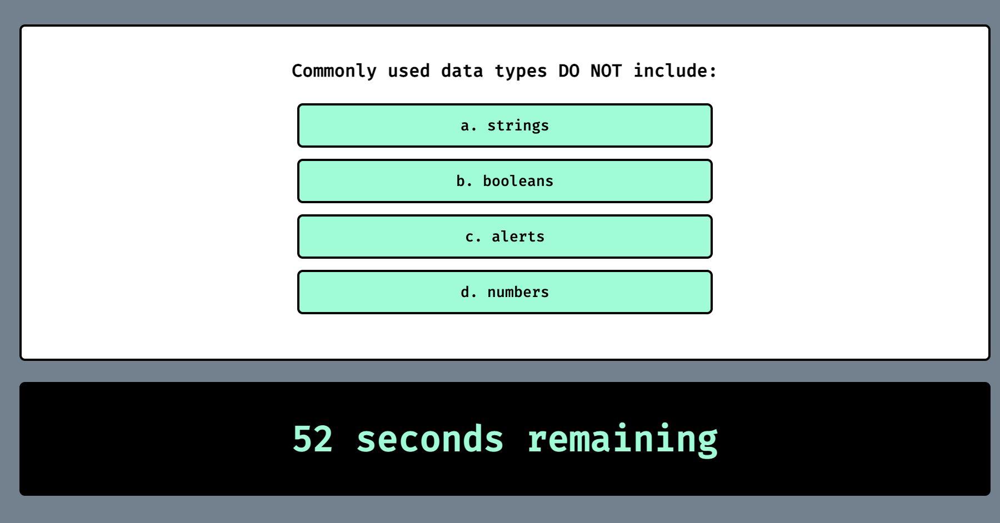
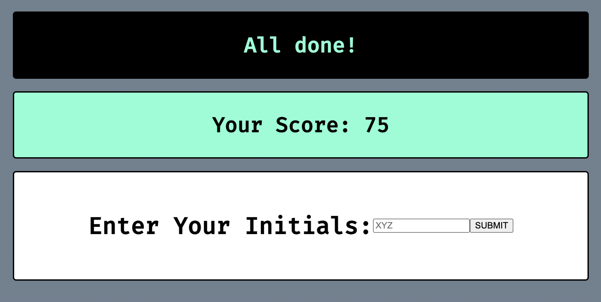

## Code-Quiz
With this application, a user is able to assess their coding knowledge. 

## User Story
AS A coding boot campe student
I WANT to take a timed quiz on JavaScript fundamentals that stores high scores
SO THAT I can gauge my progress compared to my peers

## Description
In this application, a user is presented with a timed quiz which calculates the final score based on answer choices; A correct answer will add 5 seconds and an incorrect answer will subtract 15 seconds. 
User is also notified if answer is correct or incorrect at the top of the page when the next question is rendered. 
After all questions in the array of questions have been answered or the timer reaches zero, the quiz is completed. The user is then presented with their score and an user-input box for their initials. 
Application is also supposed to store scores locally and render a "High Scores" list, consisting of player initials and final score, however, it is currently incomplete and it does not store a user's score nor does it render a list of High Scores. This will be fixed at a later date. 

## Screenshot of Deployed Application 

Screenshot showing how application loads initially

Screenshot showing how questions will be presented

Screenshot showing final score 

## Link to Deployed Application
GitHub : https://fwinkler3.github.io/Code-Quiz/

## Contact Info 
Frank Winkler III
 
GitHub : https://github.com/FWinkler3 
 
Email: frank.w.winkler@gmail.com 